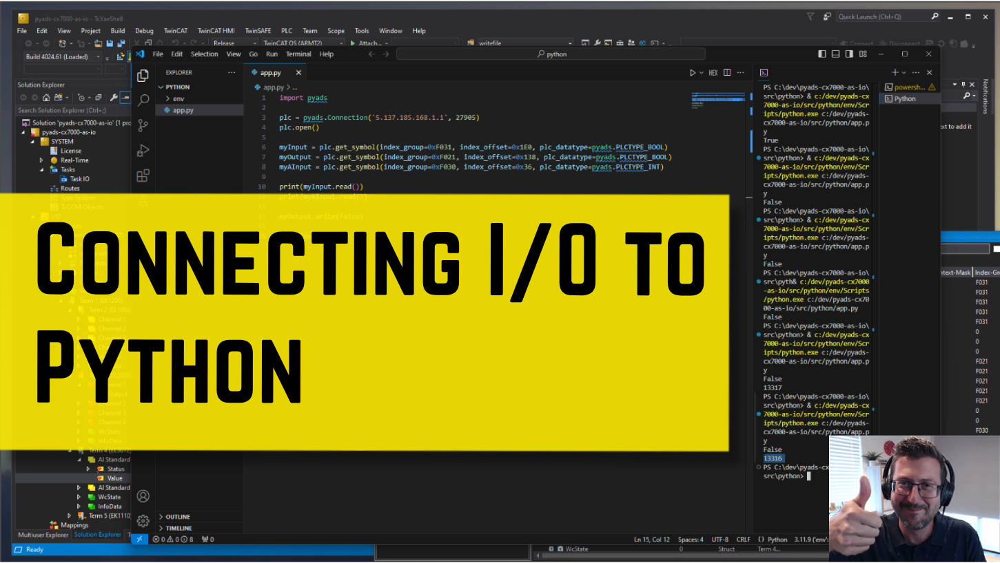
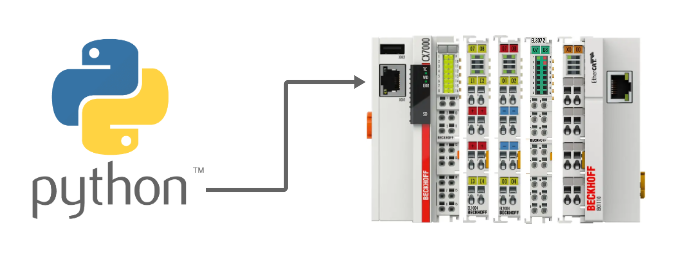

# Simple example of connecting any EtherCAT I/O to Python, using a CX7000

## Disclaimer

This is a personal guide not a peer reviewed journal or a sponsored publication. We make
no representations as to accuracy, completeness, correctness, suitability, or validity of any
information and will not be liable for any errors, omissions, or delays in this information or any
losses injuries, or damages arising from its display or use. All information is provided on an as
is basis. It is the reader’s responsibility to verify their own facts.

The views and opinions expressed in this guide are those of the authors and do not
necessarily reflect the official policy or position of any other agency, organization, employer or
company. Assumptions made in the analysis are not reflective of the position of any entity
other than the author(s) and, since we are critically thinking human beings, these views are
always subject to change, revision, and rethinking at any time. Please do not hold us to them
in perpetuity.

## Overview

This example shows how it's possible to connect to EtherCAT terminals and slaves via Python using [pyads](https://github.com/stlehmann/pyads). This requires no PLC coding on the CX.

## Video Tutorial

There is a free coding byte video tutorial on this code which can be found [here](https://www.youtube.com/watch?v=XeMbTYryr5Y)

[](https://www.youtube.com/watch?v=XeMbTYryr5Y)

## Screenshot



## Getting Started

This section provides a guide on how to set up and run the project locally.

### Prerequisites

- Python 3.x
- git (for cloning the repository)

### Installation

Follow these steps to set up your local development environment:

#### 1. Clone the Repository

First, clone the repository to your local machine:

```bash
git clone https://github.com/benhar-dev/pyads-cx7000-as-io.git
cd pyads-cx7000-as-io\src\python\
```

#### 2. Set Up the Virtual Environment

Create a virtual environment in the project directory:

```bash
python -m venv env
```

Activate the virtual environment:

```bash
.\env\Scripts\activate
```

#### 3. Install Dependencies

Install the required Python packages from requirements.txt:

```bash
pip install -r requirements.txt
```

### Running the Application

To run the application, use the following command:

```bash
python app.py
```

## Need more help?

Please visit http://beckhoff.com/ for further guides
